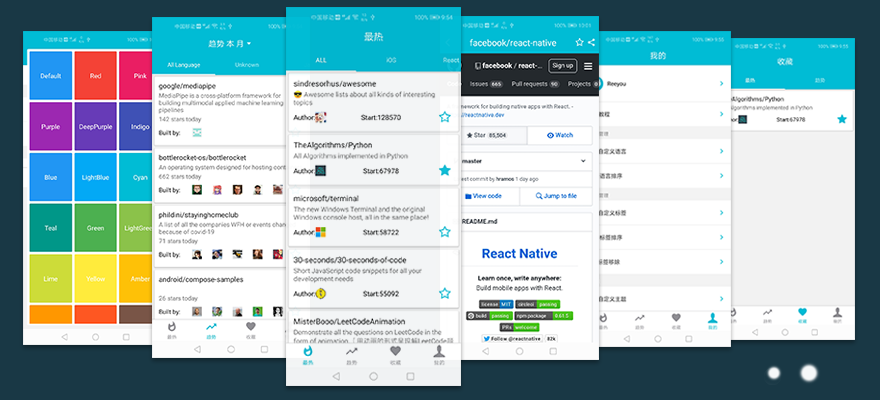

# Github_app

> ##### 技术栈：react-native(>0.6) + react-navigation(4.x)+ redux
> ##### 实现效果：手机app查看github开源项目


## 项目简介
* 基于react-native开发，
* 该项目涵盖了Github最热(star最多)项目、趋势、项目收藏、个人中心四大版块
* 封装离线缓存框架，通过校验请求时间戳缓存api接口请求数据，节省加载时间，增强用户体验
* 使用FlatList展示版块项目列表，封装BaseItem通用组件实现子类列表收藏功能继承，实现上拉刷新、下拉加载
* 封装NavigationBar实现不同页面展示的导航状态栏
* 集成redux实现项目中单向数据流、全局主题自定义
* 实现启动屏及CodePush版本打包、检查更新下载


## 主要功能

 **已实现功能** 
- [x] 最热模块
- [x] 趋势模块
- [x] 收藏模块
- [x] 详情页
- [x] 个人关于模块
- [x] 语言、标签自定义
- [x] 语言、标签排序
- [x] 主题自定义
- [x] Splash启动屏
- [x] CodePush版本更新

 **待开发功能**
- [ ] 搜索模块
- [ ] 社会化分享
- [ ] 第三方登录
- [ ] 数据统计

            

**App图片预览**

#### 主要功能部分截图(最热、趋势、收藏、我的、详情、主题)



## 运行

``` bash
# clone to local
git clone ...
# install dependencies
npm install

# run-android device
react-native run-android

```
## 第三方库
* redux
* react-redux
* redux-thunk
* react-navigation
* react-native-parallax-scroll-view
* react-native-vector-icons
* react-native-webview
* react-native-easy-toast
* react-native-code-push
* react-native-splash-screen


